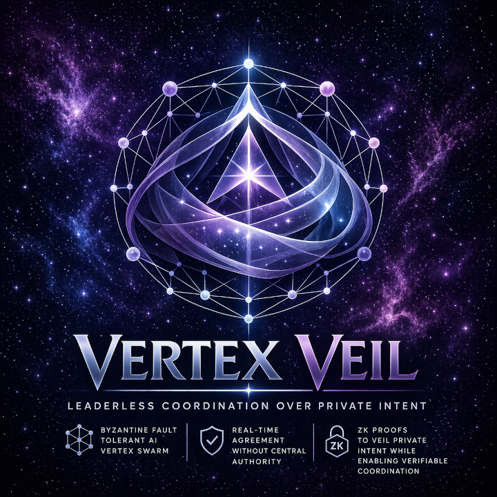

# Vertex Veil

<div align="center">
  
</div>

## Leaderless agent coordination over private intent

**Thesis:** Vertex Veil is a framework for building multi-agent systems that reach verifiable joint outcomes without revealing what any participant wanted.

Coordination today reveals intent as a side effect of coordinating. Agents publish bids, capabilities, preferences, and constraints just to participate — leaking strategy, identity, and attack surface in exchange for the ability to cooperate. That tradeoff doesn't scale to autonomous systems from independent principals, who can neither surrender their private state to a trusted orchestrator nor broadcast it to the network.

Vertex Veil treats privacy and coordination as the same problem at different layers. The Tashi Vertex Engine provides leaderless ordering, finality, and Byzantine fault tolerance. Noir circuits provide private constraint validation with publicly verifiable proofs. Fused, they enable a single primitive: a swarm that reaches cryptographically verifiable agreement on outcomes satisfying every participant's private constraints — without any participant or observer learning anyone else's intent beyond what the outcome structurally requires.

The framework is protocol-first and scenario-agnostic. Intents, commitments, round state, predicates, proposer rotation, proof interfaces, and the coordination record are all reusable components. The first validated scenario is compute-task matching between a requester and multiple providers with private prices and public capabilities, but the same primitives compose to private task auctions, consensus over private observations, capability-proven collaboration between competitors, and any coordination problem where intent has private structure.

The structural guarantee: every coordination round produces a public record sufficient for a third party to verify the outcome was valid — that all participants' private constraints were satisfied, the match was deterministic given committed intents, and no replay or equivocation occurred — without access to any private input from any agent. Verifiable correctness, without surveillance. Coordination, without revelation.

> **Status:** `v1` in development. The first validated scenario is resource-task matching
> between a requester and multiple providers. The protocol primitives are designed to
> compose; generalization is earned incrementally by additional validated scenarios.

## What Vertex Veil Proves

Vertex Veil combines four things in one runnable system:

- **Tashi Vertex ordering and failure handling** across a real multi-node cluster.
- **Noir ZK proofs** for requester/provider acceptance checks.
- **Visible fallback and rejection handling** for invalid proofs, replay-like misuse, double-commit attempts, and dropped or silent participants.
- **Third-party verifiability** from public artifacts alone.

At a high level:

- one requester publishes a public capability need and privately holds a budget
- providers publish public capability claims and privately hold reservation constraints
- Vertex orders commitments, proposals, proofs, and receipts
- Noir proves the chosen match satisfies the private predicate
- a verifier later replays the public record and reports `valid=true`

## Architecture

```text
┌──────────┐   ┌──────────┐   ┌──────────┐   ┌──────────┐
│ Agent n1 │   │ Agent n2 │   │ Agent n3 │   │ Agent nX │
│ requester│   │ provider │   │ provider │   │   ...    │
└────┬─────┘   └────┬─────┘   └────┬─────┘   └────┬─────┘
     │              │              │              │
     └──────────────┴───────┬──────┴──────────────┘
                            ▼
               ┌────────────────────────┐
               │      Tashi Vertex      │
               │    Consensus Engine    │
               └────────────┬───────────┘
                            ▼
        commitments -> proposal -> proofs -> receipt
                            │
                            ▼
              ┌─────────────────────────┐
              │ public artifact bundle  │
              │ third-party verifiable  │
              │ with no private inputs  │
              └─────────────────────────┘
                            │
                            ▼
                  verify artifacts ...
                            │
                            ▼
                      valid = true
```

## Install

You need Rust and Noir available locally.

### Rust

Install Rust with `rustup` if you do not already have it:

```bash
curl https://sh.rustup.rs -sSf | sh
```

Then confirm:

```bash
cargo --version
rustc --version
```

### Noir

Install Noir by following the official installation guide:

- <https://noir-lang.org/docs/getting_started/noir_installation>

Then confirm:

```bash
nargo --version
```

> **Note on Version Pinning:** The `nargo` version in your environment **must match** the `noir_rs` version pinned in [`crates/vertex-veil-noir/Cargo.toml`](crates/vertex-veil-noir/Cargo.toml). At the time of writing, both use `1.0.0-beta.20`. If this drifts, the `Cargo.toml` is the source of truth. Mismatched versions will fail.

Vertex Veil expects `nargo` to be available because the reproducible setup compiles the circuits before running the agents.

## Reproducible Setup

From the `vertex-veil/` directory:

```bash
cd circuits
nargo compile --workspace
cd ..

cargo build -p vertex-veil-agents --release --features vertex-transport
```

## Running Tests

The test suite covers protocol logic, round-state enforcement, adversarial scenarios, verifier correctness, and Noir circuit constraints — over 230 tests in total.

Run all Rust tests:

```bash
cargo test
```

Run all Noir circuit tests:

```bash
cd circuits
nargo test --workspace
```

## Fastest Reproduction: Vertex Transport, Single Command

This is the recommended first run for a fresh user. It uses the real Tashi Vertex transport, spawns four node processes, and writes one public bundle per node.

```bash
cargo run --release -p vertex-veil-agents --features vertex-transport -- \
  demo-bft \
  --scenario fixtures/scenario-bft-rejoin.toml \
  --artifacts artifacts/bft-demo
```

Then verify any node's bundle:

```bash
cargo run --release -p vertex-veil-agents -- \
  verify --artifacts artifacts/bft-demo/n1
```

The command above creates `artifacts/bft-demo/n1`, `n2`, `n3`, and `n4`. If you want to confirm the exact bundle layout first, a known-good example from this repository is `artifacts/bft-readme-check/n1` (assuming it has been generated).

What you should see in the aggregated output:

- `[COORD] commitment from ...` across all four nodes
- `[COORD] proposal by ...`
- `[COORD] proof verified for ...`
- `[COORD] receipt signed by ...`
- `[VERTEX] round N committed (finalized=true)`
- child exit summaries with `valid=true`

This flow is bounded: it runs a real Vertex-backed session to completion, writes artifacts, and exits.

## Persistent Cluster and Manual Rejoin

If you want a multi-terminal demo that stays alive long enough to kill and restart nodes manually, use `node --persist`.

Open four terminals in `vertex-veil/` and run:

```bash
./bin/start.sh 1 --artifacts artifacts/persist-demo --persist
```

```bash
./bin/start.sh 2 --artifacts artifacts/persist-demo --persist
```

```bash
./bin/start.sh 3 --artifacts artifacts/persist-demo --persist
```

```bash
./bin/start.sh 4 --artifacts artifacts/persist-demo --persist
```

Each node will:

- stay connected to the Vertex cluster
- complete a bounded coordination session
- checkpoint the latest public artifacts
- wait briefly
- start the next session automatically

Verify the latest bundle for any node while the cluster is still running:

```bash
cargo run --release -p vertex-veil-agents -- \
  verify --artifacts artifacts/persist-demo/node-11111111
```

To simulate a node failure, stop one terminal or kill that process. To restart the same node into the running cluster, use `--rejoin`:

```bash
./bin/start.sh 3 --artifacts artifacts/persist-demo --persist --rejoin
```

To stop the whole cluster:

```bash
./bin/killall.sh
```

Notes:

- `--persist` is the long-lived manual demo path.
- `--rejoin` is only for a node that is returning to an existing running cluster.
- `verify` always checks the latest completed session snapshot currently stored in that node's artifact directory.

## Repo Map

Notable implementation entry points include:

- [`crates/`](crates/)
  - [`vertex-veil-core/`](crates/vertex-veil-core/) — protocol logic, verifier, artifacts, round machine
    - [`runtime.rs`](crates/vertex-veil-core/src/runtime.rs) — coordination protocol loop
    - [`round_machine.rs`](crates/vertex-veil-core/src/round_machine.rs) — round-state enforcement
    - [`verifier.rs`](crates/vertex-veil-core/src/verifier.rs) — public-only verification
  - [`vertex-veil-noir/`](crates/vertex-veil-noir/) — Rust to Noir bridge and proof integration
  - [`vertex-veil-agents/`](crates/vertex-veil-agents/) — CLI surface: `demo`, `verify`, `node`, `demo-bft`
    - [`vertex_transport.rs`](crates/vertex-veil-agents/src/vertex_transport.rs) - Tashi Vertex transport adapter
    - [`orchestrate.rs`](crates/vertex-veil-agents/src/orchestrate.rs) - `demo-bft` multi-process launcher and failure injector
    - [`node.rs`](crates/vertex-veil-agents/src/node.rs) - Single-node runner, persistent mode, artifact checkpointing
- [`circuits/`](circuits/) — Noir workspace for private constraint validation
  - [`requester//main.nr`](circuits/requester/src/main.nr) — validates requester's budget and capability needs
  - [`provider//main.nr`](circuits/provider/src/main.nr) — validates provider's minimum price and capabilities
  - [`shared//lib.nr`](circuits/shared/src/lib.nr) — shared types and utility functions
- [`fixtures/`](fixtures/) — topologies, private intents, adversarial scenarios
- [`bin/`](bin/) — helper scripts for starting and stopping manual clusters
- [`intent/`](intent/) — IDD artifacts and execution history

## Failure Modes and Safety Checks

The codebase explicitly handles and tests failure paths rather than only the happy path.

Examples exercised in code and scenarios include:

- invalid or tampered proofs
- replayed prior-round commitments
- duplicate / double commitments
- wrong-round messages
- origin mismatch between message envelope and payload
- dropped or silent nodes
- proposer fallback to the next deterministic proposer
- coherent abort with public artifact output when max rounds are exceeded

The public `rejections` trace in `coordination_log.json` is how these cases remain visible to a verifier.

## Topology and Configuration

The validated baseline is a 4-node cluster:

- `n1` requester
- `n2`, `n3`, `n4` providers

The topology and private-intent fixtures are runtime-loaded from TOML, so you can inspect or adapt them directly. For example:

- [`fixtures/topology-4node.toml`](fixtures/topology-4node.toml)
- [`fixtures/topology-4node.private.toml`](fixtures/topology-4node.private.toml)

Artifacts are written per run or per node depending on the command:

- `demo` writes one bundle to the target directory
- `demo-bft` writes one bundle per node under `<artifacts>/n1`, `<artifacts>/n2`, etc.
- `node --persist` writes the latest completed session to `<artifacts>/<node-alias-or-node-prefix>/`

## Artifact Bundle Contents

Every completed or coherently aborted run writes public-only artifacts:

- `coordination_log.json` — ordered public protocol record
- `verifier_report.json` — verifier verdict
- `run_status.json` — summary for quick inspection
- `completion_receipt.json` — signed receipt when finalized
- `topology.toml` — topology snapshot used for verification
- `scenario.toml` — scenario snapshot when a scenario was supplied
- `bundle_README.md` — human-readable explanation of the bundle

You can verify any saved bundle with:

```bash
cargo run --release -p vertex-veil-agents -- verify --artifacts <path-to-bundle>
```

## Deterministic Dev Path

The repository still includes a deterministic in-process transport used for fast protocol debugging and repeatable local testing.

That path is exposed through `demo`:

```bash
cargo run --release -p vertex-veil-agents -- \
  demo --topology fixtures/topology-4node.toml \
       --scenario fixtures/replay-doublecommit-drop.toml \
       --artifacts artifacts/demo \
       --narrate
```

It is useful for deterministic local iteration and exercising adversarial protocol scenarios without the network layer. But the main project story is the real Vertex-backed transport shown by `demo-bft` and `node --persist`.
